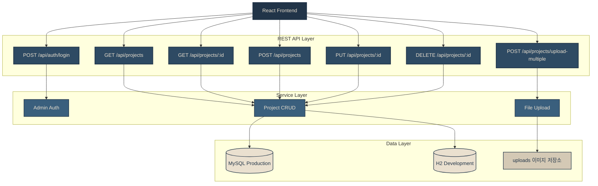
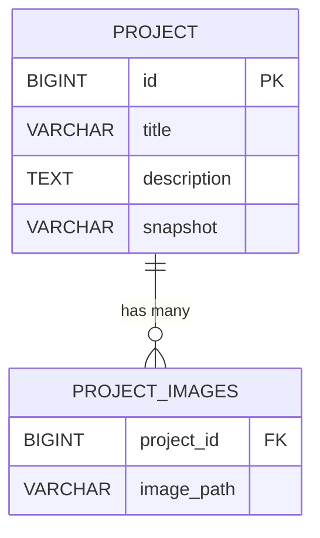

# ⚙️ Backend: The Weaver Content Management API

> **"Storing the threads of creativity."**
> 전시물 데이터를 안전하게 저장하고, 대용량 이미지 자산을 효율적으로 관리하는 Spring Boot 기반의 REST API 서버입니다.
> 관리자가 직접 포트폴리오를 업데이트할 수 있는 CMS(Content Management System) 기능을 제공합니다.

---

## 🗺️ Architecture & Routing



---

## 🛠️ Tech Stack

| 분류 | 기술 |
|---|---|
| Framework | Spring Boot 3.4.x |
| Language | Java 17 |
| Database | MySQL (Production) / H2 (Development) |
| ORM | Spring Data JPA |
| Build Tool | Maven |
| 코드 최적화 | Lombok |

---

## 🔧 Technical Deep-Dive

### 1. 효율적인 데이터 구조 설계 — `@ElementCollection`

매거진 스타일 포트폴리오는 게시물 하나당 다수의 이미지와 긴 본문을 포함합니다. 별도의 엔티티 선언 없이 `@ElementCollection`으로 이미지 경로 리스트를 1:N 테이블로 자동 매핑하여 구조를 단순화했습니다.

```java
@Entity
@Getter @Setter
public class Project {
    @Id
    @GeneratedValue(strategy = GenerationType.IDENTITY)
    private Long id;

    private String title;

    @Column(columnDefinition = "TEXT") // 긴 스토리텔링 본문 처리
    private String description;

    @ElementCollection // 다중 이미지 경로를 별도 엔티티 없이 저장
    @CollectionTable(name = "project_images", joinColumns = @JoinColumn(name = "project_id"))
    @Column(name = "image_path")
    private List<String> images = new ArrayList<>();

    private String snapshot; // 대표 썸네일 경로
}
```

---

### 2. 다중 파일 업로드 및 정적 리소스 매핑

**파일명 충돌 방지**
`System.currentTimeMillis()`를 원본 파일명과 결합하여 서버 내 파일명 중복을 방지했습니다.

**물리적 경로 → URL 매핑**
`WebMvcConfigurer`로 서버 로컬 폴더(`/uploads/`)를 외부에서 URL로 접근 가능하도록 정적 리소스 핸들러를 설정했습니다.

```java
@PostMapping("/upload-multiple")
public List<String> uploadMultipleFiles(@RequestParam("files") List<MultipartFile> files) throws IOException {
    List<String> filePaths = new ArrayList<>();
    String uploadDir = System.getProperty("user.dir") + "/uploads/";

    for (MultipartFile file : files) {
        if (!file.isEmpty()) {
            String fileName = System.currentTimeMillis() + "_" + file.getOriginalFilename();
            file.transferTo(new File(uploadDir + fileName));
            filePaths.add("/uploads/" + fileName);
        }
    }
    return filePaths;
}
```

---

### 3. 보안 설계

**환경변수 기반 인증**
관리자 비밀번호를 `application.properties`의 `${MY_ADMIN_PASSWORD}` 형식으로 관리하여 소스 코드 유출 시에도 보안을 유지합니다.

**CORS 정책**
프론트엔드(`localhost:5173`)와의 안전한 통신을 위해 CORS 정책을 명시적으로 설정했습니다.

---

## 🚀 API Endpoints

### Projects

| Method | Endpoint | Description |
|---|---|---|
| `GET` | `/api/projects` | 전시물 목록 전체 조회 (최신순) |
| `GET` | `/api/projects/{id}` | 특정 전시물 상세 조회 |
| `POST` | `/api/projects/upload-multiple` | 다중 이미지 파일 업로드 |
| `POST` | `/api/projects` | 새 전시물 등록 |
| `PUT` | `/api/projects/{id}` | 기존 전시물 수정 |
| `DELETE` | `/api/projects/{id}` | 전시물 삭제 |

### Authentication

| Method | Endpoint | Description |
|---|---|---|
| `POST` | `/api/auth/login` | 관리자 로그인 및 인증 |

---

## 🗄️ Database Schema



> **💡 팁:** 이미지 파일로 직접 넣고 싶으시다면 위 코드를 지우고 `` 형식으로 작성하시면 됩니다.

---

## 🚀 Quick Start

```bash
# 1. 저장소 클론
git clone https://github.com/hoilycat/the-code-weaver-backend.git
cd the-code-weaver-backend

# 2. 환경변수 설정
# application.properties에서 MY_ADMIN_PASSWORD 등록

# 3. 빌드 및 실행
./mvnw spring-boot:run
```

> 개발 환경에서는 H2 인메모리 DB가 자동으로 실행됩니다.

---

## 🔗 Related

- [Frontend Repository](https://github.com/hoilycat/the-code-weaver-frontend) — React 19 + GSAP + Framer Motion
- [Live Site](https://the-weaver.vercel.app)
