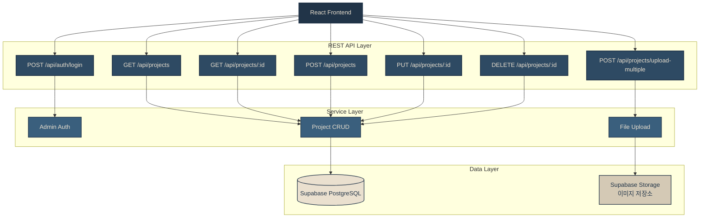
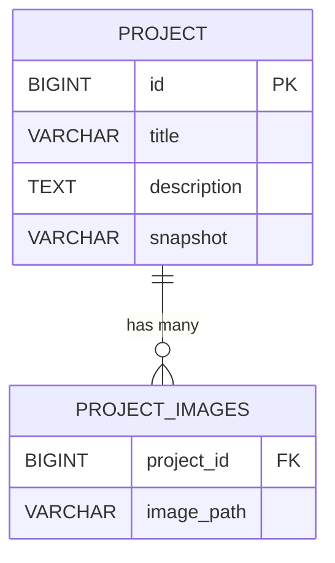

# ⚙️ Backend: The Weaver Content Management API

> **"Storing the threads of creativity."**
><div align="center">
>  
>  
>  
>  
>  
></div>
><br><br>
> Production API: https://the-code-weaver-backend.onrender.com
>
> 전시물 데이터를 안전하게 저장하고, 대용량 이미지 자산을 효율적으로 관리하는 Spring Boot 기반의 REST API 서버입니다.
> 관리자가 직접 포트폴리오를 업데이트할 수 있는 CMS(Content Management System) 기능을 제공합니다.

---

## 🗺️ Architecture & Routing



---

## 🛠️ Tech Stack

| 분류 | 기술 |
|---|---|
| **Framework** |  |
| **Language** |  |
| **Database** |   |
| **Storage** |  |
| **ORM** |  |
| **Build Tool** |  |

---

## 🔧 Technical Deep-Dive

### 1. 효율적인 데이터 구조 설계 — `@ElementCollection`

매거진 스타일 포트폴리오는 게시물 하나당 다수의 이미지와 긴 본문을 포함합니다. 별도의 엔티티 선언 없이 `@ElementCollection`으로 이미지 경로 리스트를 1:N 테이블로 자동 매핑하여 구조를 단순화했습니다.

```java
@Entity
@Getter @Setter
public class Project {
    @Id
    @GeneratedValue(strategy = GenerationType.IDENTITY)
    private Long id;

    private String title;

    @Column(columnDefinition = "TEXT") // 긴 스토리텔링 본문 처리
    private String description;

    @ElementCollection // 다중 이미지 경로를 별도 엔티티 없이 저장
    @CollectionTable(name = "project_images", joinColumns = @JoinColumn(name = "project_id"))
    @Column(name = "image_path")
    private List<String> images = new ArrayList<>();

    private String snapshot; // 대표 썸네일 경로
}
```

---

### 2. 다중 파일 업로드 — Supabase Storage 연동

**파일명 충돌 방지**
`System.currentTimeMillis() + UUID`를 조합하여 동시 업로드 시에도 파일명 중복이 발생하지 않도록 했습니다.

**Supabase Storage REST API 연동**
서버 로컬 디스크 대신 Supabase Storage에 업로드하여 Render 재배포 시 이미지가 사라지는 문제를 해결했습니다. `RestTemplate`으로 Supabase Storage REST API를 직접 호출하고, 업로드 성공 시 Public URL을 반환합니다.

```java
@PostMapping("/upload-multiple")
public List<String> uploadMultipleFiles(@RequestParam("files") List<MultipartFile> files) throws IOException {
    List<String> publicUrls = new ArrayList<>();

    for (MultipartFile file : files) {
        if (file.isEmpty()) continue;

        // UUID로 파일명 중복 방지
        String fileName = "uploads/" + System.currentTimeMillis() + "_" + UUID.randomUUID() + getFileExtension(file);
        String uploadUrl = String.format("%s/storage/v1/object/%s/%s", supabaseUrl, supabaseBucket, fileName);

        HttpHeaders headers = new HttpHeaders();
        headers.set("Authorization", "Bearer " + supabaseKey);
        headers.set("apikey", supabaseKey);
        headers.setContentType(MediaType.parseMediaType(file.getContentType()));

        restTemplate.exchange(uploadUrl, HttpMethod.POST, new HttpEntity<>(file.getBytes(), headers), String.class);

        publicUrls.add(String.format("%s/storage/v1/object/public/%s/%s", supabaseUrl, supabaseBucket, fileName));
    }
    return publicUrls;
}
```

---

### 3. 보안 설계

**환경변수 기반 인증**
관리자 비밀번호를 `application.properties`의 `${MY_ADMIN_PASSWORD}` 형식으로 관리하여 소스 코드 유출 시에도 보안을 유지합니다.

**인증 구조 (현재)**
포트폴리오 CMS 특성상 사용자가 관리자 한 명뿐이므로, 단일 비밀번호 검증 방식의 임시 인증 구조로 구현했습니다. 실제 서비스 환경으로 확장 시에는 Spring Security + JWT 기반 인증 구조로 전환할 예정입니다.

```java
// 현재: 관리자 단일 비밀번호 검증 (임시 구조)
// 확장 예정: Spring Security + JWT (jjwt) 기반 토큰 인증
@PostMapping("/login")
public ResponseEntity<?> login(@RequestBody Map<String, String> credentials) {
    if (adminPassword.equals(credentials.get("password"))) {
        return ResponseEntity.ok(Map.of("token", "authenticated"));
    }
    return ResponseEntity.status(401).body("비밀번호가 틀렸습니다.");
}
```

**CORS 정책**
프론트엔드 배포 환경(`https://the-weaver.vercel.app`) 및 로컬 환경(`localhost:5173`)과의 안전한 통신을 위해 CORS 허용 출처를 명시적으로 설정했습니다.

---

## 🚀 API Endpoints

### Projects

| Method | Endpoint | Description |
|---|---|---|
| `GET` | `/api/projects` | 전시물 목록 전체 조회 (최신순) |
| `GET` | `/api/projects/{id}` | 특정 전시물 상세 조회 |
| `POST` | `/api/projects/upload-multiple` | 다중 이미지 파일 업로드 |
| `POST` | `/api/projects` | 새 전시물 등록 |
| `PUT` | `/api/projects/{id}` | 기존 전시물 수정 |
| `DELETE` | `/api/projects/{id}` | 전시물 삭제 |

### Authentication

| Method | Endpoint | Description |
|---|---|---|
| `POST` | `/api/auth/login` | 관리자 로그인 및 인증 |

---

## 🗄️ Database Schema




---

## 🚀 Quick Start

```bash
# 1. 저장소 클론
git clone https://github.com/hoilycat/the-code-weaver-backend.git
cd the-code-weaver-backend

# 2. 환경변수 설정
# application.properties에서 MY_ADMIN_PASSWORD 등록

# 3. 빌드 및 실행
./mvnw spring-boot:run
```

> 환경변수 `SUPABASE_URL`, `SUPABASE_KEY`, `SUPABASE_BUCKET`, `MY_ADMIN_PASSWORD`를 설정해야 합니다.

---

## 🔗 Related

- [Frontend Repository](https://github.com/hoilycat/the-code-weaver-frontend) — React 19 + GSAP + Framer Motion
- [Live Site](https://the-weaver.vercel.app)
---

